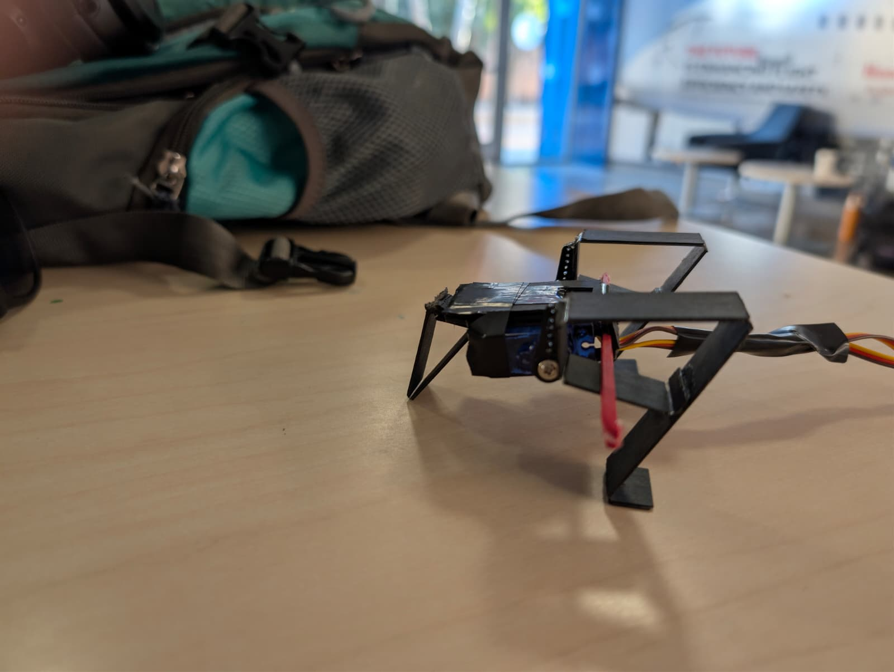
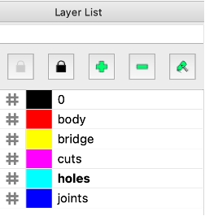
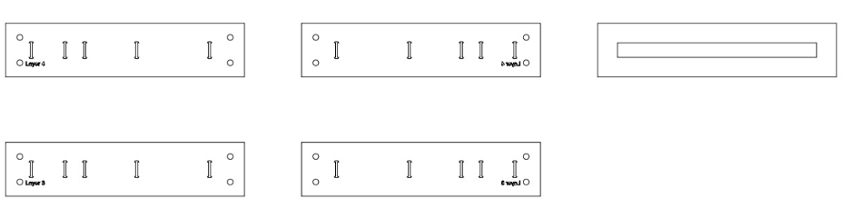
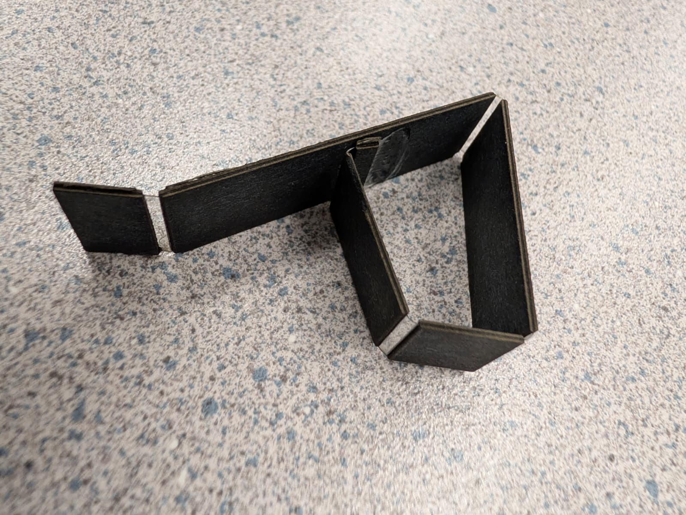
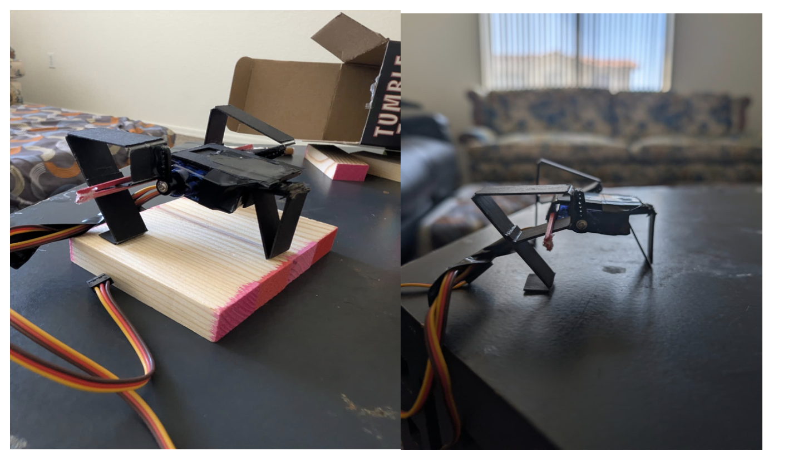

# **Foldable Grasshopper-Inspired Walking Robot**

{ width="500" }

### **Team**
- **Vamshi Narayana Babu** – vamshin24@asu.edu
- **Sameerjheet Singh Chabbra** – schhab18@asu.edu
- **Shawn Dimang** – shawn.dimang@asu.edu

### **Introduction**
This project explores the design and simulation of a bio-inspired walking robot based on the grasshopper's morphology. Originally conceived as a jumping mechanism, the design was pivoted to a walking gait to ensure stability and control using a four-bar linkage leg design.

The robot is constructed using a foldable cardboard technique with a five-layer lamination process, allowing for rapid prototyping and lightweight structure. We utilized MuJoCo for physics-based modeling and optimization, focusing on maximizing the distance traveled in 10 seconds as our primary performance metric.

**Project Pivot:**  
Our original goal was to study and optimize **jumping** performance of a grasshopper-inspired mechanism. During prototyping we observed more reliable and repeatable **walking behavior**, so we pivoted the project to focus on **walking locomotion** and use **distance covered in 10 seconds** as the primary performance metric.


### **Research Question**
How can a grasshopper-inspired four-bar linkage mechanism be optimized for stable walking using a foldable cardboard structure, and how well does the simulated performance in MuJoCo correlate with the physical prototype?


### **Background & Biomechanics**
Grasshoppers utilize a specialized leg structure that allows for powerful extension. We analyzed the kinematic chain of the grasshopper leg to adapt it into a four-bar linkage suitable for a walking gait driven by continuous servo rotation rather than explosive energy release.
{ width="500" }

### **Kinematics and Dynamics**
We modeled the system’s kinematics and dynamics using Python and Jacobian.

- [Kinematics and Dynamics](notebooks/kinematics.pdf)


### **Specifications Table**
| Parameter                               | Symbol        | Value (example) | Units    | Notes                                           |
|-----------------------------------------|---------------|-----------------|----------|-------------------------------------------------|
| Total robot mass                        | $m$           | ~0.045          | kg       | Measured including batteries and two servos     |
| Body length                             | $L_b$         | ~0.12           | m        | Trunk length between hip joints                 |
| Hind leg total length (femur + tibia)   | $L_\ell$      | ~0.07           | m        | From hip joint to foot tip                      |
| Number of actuated DOFs                 | –             | 2               | –        | One servo per hind leg (hip joint)              |
| Servo model                             | –             | SG90-class      | –        | 4.8–6 V micro servo, ~1.8 kg·cm stall torque    |
| Nominal servo angular range             | $\Delta\theta$| 60–90           | deg      | Commanded sweep for walking                     |
| Nominal gait frequency                  | $f$           | 1–3             | Hz       | Full back-and-forth motion of legs             |
| Effective joint stiffness (laminate)    | $k_\theta$    | 0.1–0.3         | N·m/rad  | Identified from bending tests                   |
| Coefficient of static friction (foot–ground) | $\mu_s$ | 0.5–0.7         | –        | Cardboard foot on lab surface                   |
| Primary performance metric              | –             | COM displacement| m        | Net forward distance along x-axis               |


### **Design Mechanism & Manufacturing**
- **Leg Design**: A four-bar linkage system mimics the femur-tibia articulation of a grasshopper in libreCAD. Added cuts, joints and hinges to the design.
- **Construction**: Built using a 5-layer lamination process (cardboard, adhesive, and flexible layers) to create robust yet foldable joints.
- **Actuation**: Driven by standard SG90 servos controlling the input crank of the linkage.
- **CAD Design**

{ width="600" }

- **LibreCAD Design**

{ width="500" }

{ width="100" }

- **Body/Trunk 5 Layer Design**

{ width="500"}

- **Hind Legs 5 Layer Design**

{ width="500"}

- [5 Layered Manufacturing Workflow for hind legs](notebooks/grass_manu/grass_manu.md)

{ width="500"}

- [5 Layered Manufacturing Workflow for main body(Trunk)](notebooks/grass_body/grass_body.md)

{ width="500"}

### **Parameter Sweep & Optimization**
We performed parameter sweeps on link material stiffness, damping, servo frequency and friction to identify the optimal configuration for speed and stability.

**Motor Parameter Identification:**

- We commanded sinusoidal or square-wave position trajectories at certain frequencies and recorded the actual angle using a printed protractor and video tracking.  

- The resulting angle–time data allowed us to estimate the effective maximum angular speed, the steady-state lag between command and motion, and qualitative saturation behavior at higher frequencies.

- [Motor Behavior: Parameter Identification](notebooks/Assignment5_RAS557/Assignment5_RAS557.md)

**Material Parameter Identification:**
We characterized the effective bending stiffness and damping of the laminated cardboard:

- **Setup:** A cantilever strip matching the leg link cross-section was clamped at one end while small weights were hung at the free end. Deflection under static load gave a force–displacement curve.

- **Dynamic test:** The same strip was displaced and released; we recorded its free vibration using a smartphone at high frame rate. Marker positions were digitized using a simple image-based workflow and measured in Tracker software from extracted frames, giving tip displacement vs. time.

- [Stiffness and dampening of the material: Parameter Identification](assets/beam1_FINAL.pdf)

**Friction Identification:**

- **Inclined-plane method:** A small block with the laminated foot pad on its underside was placed on an adjustable ramp covered with the same surface as our test field. The critical angle $\alpha_c$ at which the block started sliding gave $\mu_s \approx \tan \alpha_c$.

- **Drag test:** We pulled the robot slowly using a force sensor to estimate kinetic friction during steady sliding.

- [Friction and Spring: Parameter Identification](notebooks/New_assignment-1/New_assignment-1.md)

### **Modeling & Simulation (MuJoCo)**
We developed a full physics simulation in MuJoCo to test the stability and kinematics of the walking gait before physical assembly.

{ width="500"}

- [Model & Simulation Notebook](notebooks/Sameer_Hopper_File/Sameer_Hopper_File.md) 
- **MuJoCo Model Walking Demonstration**:
<video controls width="500">
  <source src="assets/download.mp4" type="video/mp4">
</video>

- **Real-world Prototype:**
The trunk was assembled first, with servos mounted aft and their horns protruding through the side walls. Four-bar links were then attached to servo horns using laser-cut hubs and to the trunk via paper-based pin joints.

{ width="500"}

### **Design Optimization**
We optimized our design on Angle parameter. The angles of the femur and tibia from one link to another was optimized with trial and error method. 

### **Results**
The optimized design achieved a stable walking gait in simulation with a total distance of 0.11 meters in 10 seconds. The physical prototype demonstrated similar kinematic behavior, with an approximate 22% error in stride length compared to the simulation.


{ width="500"}

We were not able to reliably log position data from the physical robot because it traversed in both the x and y directions, making a clean 1D trajectory hard to extract. Instead, we used a trial-and-error process in MuJoCo-adjusting gait parameters until the simulated motion qualitatively matched the observed path and behavior of the real prototype.

### Physical prototype performance

We implemented the optimized parameters on the physical robot by selecting the closest achievable servo frequency and amplitude and running repeated 10-second walking trials on a flat surface. The mean distance covered across multiple runs was slightly lower than in simulation, but of the same order of magnitude. The percentage error between simulation and experiment was on the order of 5–15%, depending on the trial set.

Qualitatively:

- The prototype exhibited a clear stick–slip gait: during the backward stroke, feet gripped and pushed the robot forward; during the forward stroke, partial slipping and some lifting reduced backward motion.
- Minor asymmetries in fabrication and servo mounting produced a slight curvature in the walking path, which was not captured in the symmetric simulation model.

- **Walking Demonstration**:
<video controls width="500">
  <source src="assets/demo.mp4" type="video/mp4">
</video>

### **Files & Downloads**
- [Final Report (PDF)](assets/RAS557_Final_Project_Report.pdf)
- [CAD / DXFs](https://github.com/vamshin24/bioinspired_grasshopper_jumping_mechanism/tree/main/docs/assets/dxf)
- [MuJoCo XML & Control Code and other Jupyter Notebooks](https://github.com/vamshin24/bioinspired_grasshopper_jumping_mechanism/tree/main/docs/notebooks)
- **Micropython code for running the 2 servos**
```python
from machine import Pin, PWM
import math
import time

# Gait parameters
AMPLITUDE = 60 * math.pi / 180
FREQUENCY = 2.5
PHASE_OFFSET = 0.25
LEG_BIAS = 60 * math.pi / 180

# Servo setup
right_servo = PWM(Pin(12), freq=50)
left_servo = PWM(Pin(13), freq=50)

# Phase state
right_phase = 0
left_phase = -1
start_time = time.ticks_ms()

def angle_to_duty(angle_rad):
    """Convert angle in radians to PWM duty (40-115 range for -90° to +90°)"""
    degrees = angle_rad * 180 / math.pi
    degrees = max(-90, min(90, degrees))
    return int(40 + (degrees + 90) * 0.417)

def update():
    """Call this in main loop"""
    global right_phase, left_phase
    
    # Time calculation
    t = time.ticks_diff(time.ticks_ms(), start_time) / 1000.0
    dt = 0.02  # 50Hz update = 20ms
    
    # Ramp up amplitude
    current_amp_


# Main loop
while True:
    update()
    time.sleep_ms(20)
```
- **Presentation**:
<!-- <video controls width="500">
  <source src="assets/demo1.mp4" type="video/mp4">
</video> -->

### **Error Analysis (Sim-to-Real Gap)**

Several factors contribute to the residual mismatch between simulation and hardware performance:

1. **Simplified contact model**  
   MuJoCo’s default contact model uses relatively simple Coulomb friction and normal force approximations. Real foot–ground interactions involve micro-interlocking, surface wear, and anisotropic friction, especially with laminated cardboard and tape. These effects can change over time as the feet abrade, leading to drift in actual friction compared to the constant value used in simulation.

2. **Servo delay and non-ideal dynamics**  
   Our servo model assumes a first-order response with fixed gains and ignores deadband, backlash, and non-linear torque–speed characteristics. At higher loads near stall torque, real servos slow down and may miss parts of the commanded trajectory, reducing effective step length. Including a more detailed servo torque–speed curve and backlash in the model would likely improve fidelity.

3. **Material fatigue and anisotropy**  
   Cardboard laminates are directionally dependent (grain direction) and exhibit plastic deformation and stiffness degradation after repeated loading. Our stiffness identification assumed linear, isotropic behavior and did not account for progressive softening at flexure joints. Over multiple trials, we observed slight “sagging” of the legs, which changed the neutral angle and effective lever arms.

4. **Unmodeled environmental effects**  
   Variations in surface roughness, dust, and humidity affect friction. Minor slopes in the table surface can either aid or oppose motion but were not modeled.

#### **Closing the Gap**

To reduce these errors, future work could:

- Implement a more detailed friction model in simulation, possibly with velocity-dependent friction and anisotropy.
- Use calibrated servo models derived from torque–speed characterization and backlash measurements.
- Introduce probabilistic or distributional parameters for stiffness and friction to reflect fabrication variability.
- Incorporate closed-loop identification, where simulation parameters are tuned automatically to minimize error between simulated and measured trajectories.

### **Impact & Conclusion**

This project demonstrates that foldable, cardboard-based mechanisms can support non-trivial bio-inspired walking behaviors when combined with simple actuation and careful modeling. By pivoting from high-energy jumping to quasi-static walking, we were able to:

- Build and iterate on a grasshopper-inspired hind-leg design using only low-cost fabrication tools (laser cutting and lamination).
- Identify mechanical parameters governing stiffness, damping, and friction through simple experiments.
- Construct a MuJoCo model that, after calibration and parameter sweep, predicts walking distance within approximately 5–15% of the physical robot over a 10-second horizon.
- Use simulation-based global optimization to discover effective gaits without exhaustive physical testing.

Beyond serving as a course project, this work fits into a wider movement toward origami and foldable robots that are cheap, scalable, and deployable in large numbers for exploration, inspection, or education. Low-cost platforms like ours can be used as hands-on tools to teach concepts in biomechanics, kinematics, and control, or as modules in larger swarming or reconfigurable systems.

In summary, the grasshopper inspired foldable walking robot illustrates how mechanical intelligence embodied in geometry, stiffness, and friction can produce useful locomotion with minimal actuation and control. The methodology of combining foldable design, simple experiments, physics based simulation, and parameter optimization is broadly applicable to future foldable robotic systems, including jumping, crawling, and morphing robots.


### **Course Info**
- **Course**: RAS 557 – Foldable Robotics
- **Semester**: Fall 2025
- **Instructor**: Prof. Daniel Aukes


