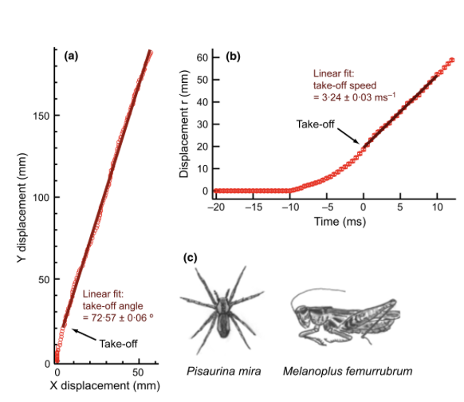

# Midterm Project Report

**RAS 557**
**Foldable Robotics**
**Group 8**

**Vamshi Narayana Babu**

**Shawn Dimang**

**Sameerjeet Singh Chhabra**

## Project Goal
We aim to study and replicate the biomechanics of the grasshopper’s hind-leg jumping mechanism — specifically how its flexible exoskeletal structures and elastic energy storage contribute to powerful, efficient jumps across different terrains.
Our goal is to translate these biological principles into an engineered system: a foldable, bio-inspired jumping mechanism that uses flexible materials to store and release energy efficiently.

**Research question:** How can bio-inspired grasshopper hind leg mechanisms use flexible material to replicate jumping?

### Design/Prototype:
A foldable, flexible-material jumping leg inspired by grasshopper biomechanics, which demonstrates high energy efficiency and robustness on multiple surfaces.

### Why this matters:
Grasshoppers achieve some of the most efficient power-to-mass jump performances in nature by combining stiff cuticular structures with compliant resilient pads and mechanical latches.
Translating this system into a foldable robotic mechanism offers insight into low-cost, lightweight, and high-power actuation — especially valuable for small mobile robots or deployable exploration systems where energy storage and terrain adaptability are key.

## Scope
To keep the project feasible within an 8-week semester, we are constraining our study to the hind-leg jumping mechanism of the grasshopper and its translation into a single foldable prototype leg. Although we will study and model one hind leg in detail (to understand its mechanics, forces, and energy storage), the prototype will feature two synchronized hind legs to better replicate grasshopper-like jumping dynamics. Instead of attempting to replicate full-body dynamics or flight trajectories, our focus is on energy storage, release, and takeoff efficiency. The system will be modeled as a foldable linkage with a compliant flexure acting as the energy storage element, using accessible materials (YET TO BE DECIDED). Analytical and simulation-based modeling will guide parameter selection (spring stiffness, leg angle, and latch geometry), followed by one physical prototype for experimental validation of jump height, distance, and efficiency. This constrained scope allows us to deliver measurable results—quantitative tests of how flexible materials influence jump performance—while staying within realistic fabrication, testing, and reporting timelines.

## Impact
This project is both scientifically interesting and practically relevant. Nature’s jumping mechanisms are highly optimized for power density and efficiency—understanding and replicating them can inspire more energy-efficient and lightweight robotic systems. Today, there is growing interest in micro-robots and field-deployable systems (for inspection, search-and-rescue, and space exploration) that need efficient motion in variable terrain. Advances in origami-inspired design, flexible composites, and low-cost laser cutting now make it possible to model and build small-scale bio-inspired mechanisms accurately. The broader impact of this work lies in improving terrain-adaptive, power-efficient locomotion. By demonstrating that foldable, flexible designs can reproduce the performance of natural jumpers, the project can inform new directions in soft robotics, deployable mechanisms, and sustainable material use for robotics education and research.

## Team Fit
Answering this question aligns closely with our team’s interests in biomechanics, energy-efficient robotics, and material-based actuation. It combines our background knowledge in mechanical design and dynamics with our curiosity about how biological systems achieve high performance through structure rather than complex control. The project lets us apply skills in modeling (linkage kinematics, spring energy analysis), rapid prototyping (foldable and flexible fabrication), and experimental testing (high-speed motion capture, efficiency measurement). Our interest in using minimal actuation and maximizing mechanical intelligence matches the essence of grasshopper jumping—where morphology and material properties, not electronics, drive performance. By focusing on this topic, we can deepen our understanding of how mechanical design and material selection together enable efficient locomotion, which directly supports future work in foldable robotics or bioinspired design research.

## Topic Fit
Our research question directly leverages foldable robotics principles as both a modeling and fabrication framework. The grasshopper leg will be represented as a foldable linkage system—a simplified mechanical analog of the femur-tibia assembly—with compliant joints and elastic folds serving as the energy storage and release elements. Using origami-inspired design techniques, we can approximate complex 3D motions with planar folds that are easy to fabricate, lightweight, and capable of storing strain energy within their material layers. Foldable mechanisms also make it possible to integrate stiffness variation and latching behavior without bulky hardware—mirroring the biological combination of hard cuticle and soft resilin in the grasshopper leg. In this way, foldable robotics is not only a fabrication method but also a conceptual tool for exploring how geometry and material flexibility interact to produce efficient motion.

## Background

{ width="600" }

(a) Plots the vertical (y) vs. horizontal (x) displacement of the grasshopper’s center of mass during take-off. The linear fit shows a take-off angle of ≈ 72.6 ± 0.06°, representing the direction of launch.
(b) Shows total displacement r(t) vs. time, with a linear fit for take-off speed ≈ 3.24 ± 0.03 m s⁻¹.
(c) Illustrates the study organisms – the grasshopper (Melanoplus femurrubrum) and its predator (Pisaurina mira).
Panels A–D show confocal micrographs of the locust’s hind femur, focusing on the semi-lunar process — the key elastic storage structure responsible for powering the jump.

{ width="600" }

*   (A, B) show external (medial and lateral) views with the semi-lunar process highlighted.
*   (C, D) show internal (medial and lateral) cross-sections, where the blue-shaded area marks regions rich in resilin, a highly elastic protein embedded within the hard chitinous cuticle.
*   The yellow arrows indicate the direction of deformation during energy storage.

*   A high-speed camera (500 fps) captures the take-off sequence of a locust over 0–52 ms. The frames show the progression from the pre-loading phase (t = 0 ms) through leg extension (≈ 40 ms) to airborne take-off (~ 52 ms).
*   Plots the angles of the body–femur, femur–tibia, tibia–tarsus, and tarsus–ground as functions of time (0–60 ms).

## Discussion – Value of Each Paper

**1) Grasshoppers alter jumping biomechanics to enhance escape performance under chronic risk of spider predation - Dror Hawlena**
This paper provides precise take-off kinematics for grasshoppers using high-speed imaging. The authors measured a take-off speed of 3.24 m/s and angle of 72.6°, which define realistic performance targets for bio-inspired jumpers. Their findings show how grasshoppers adjust joint angles and pre-loading based on environmental pressure, demonstrating the importance of adaptive biomechanics. For our project, these data guide the target motion and efficiency benchmarks for the foldable leg design, ensuring the prototype mimics natural speed and trajectory.

**2) Biomechanical and dynamic mechanism of locust take-off - Chen et al., 2014**
Chen et al. (2014) present a dynamic model of locust take-off mechanics, combining kinematic data and force analysis. Their high-speed footage (0–52 ms) and joint-angle plots reveal how elastic energy stored in the semi-lunar process converts to rapid extension and lift. The study quantifies energy output (~10–14 mJ) and ground-reaction forces (8–10× body weight), giving mechanical parameters for energy release and spring stiffness.

**3) Dynamic model and performance analysis of a rigid–flexible coupling four-bar leg for a small bio-inspired jumping robot. - Zhang, J., Chen, W., Wang, J., & Liu, Z. (2019)**
Zhang et al. developed a rigid–flexible coupled four-bar leg for a small jumping robot, showing that incorporating compliant elements improves jump stability and distance. Their model demonstrates how flexibility can increase energy storage and recovery, especially on uneven terrain. This research directly parallels our project’s intent to use foldable, flexible materials to improve energy efficiency and multi-terrain performance.

**4) Design of a Grasshopper-like Jumping Mechanism in a Biomimetic Approach. - Eroğlu, A. K. (2007)**
Eroğlu’s thesis translates grasshopper anatomy into a functional mechanical model, detailing femur–tibia geometry, link ratios, and spring mechanics. It provides the foundational parameters—leg lengths, angular ranges, and material constraints—that make biological motion achievable in a robotic form. For our project, this serves as the geometric and conceptual baseline for designing a foldable leg that reproduces the natural motion sequence while incorporating flexible components for energy efficiency.

**5) Locusts use a composite of resilin and hard cuticle as an energy store for jumping - Burrows, M., & Sutton, G. P. (2012)**
Explains the material science of energy storage in insects. By quantifying stiffness differences between resilin and cuticle, it guides our flexible material selection for the foldable mechanism.

## Novelty of Our Project
Previous research has focused separately on either the biomechanics (Hawlena, Chen, Burrows) or robotic translation(Zhang, Eroğlu) of the grasshopper jump. Our project uniquely combines both through foldable robotics techniques and flexible materials to replicate the biological stiffness–compliance composite within a single mechanism. By modeling and prototyping a foldable two-leg jumping system that adapts to different terrains, we aim to demonstrate improved jump efficiency and reusability. This integration of biological material principles, origami-inspired fabrication, and multi-terrain testing defines the novelty and relevance of our research within bio-inspired robotics.

## Estimated Goal Performance Metrics
To define target performance for our foldable, grasshopper-inspired jumping mechanism, we estimate the velocity, height, spring energy, and torque required for efficient take-off based on biological data and mechanical analogs.

| Parameter | Typical Value / Insight | Source |
| :--- | :--- | :--- |
| Body mass | ~2–3 g (Schistocerca gregaria) | Chen et al., 2014 |
| Hind-leg length | Femur ≈ 18 mm Tibia ≈ 22 mm | Eroğlu 2007 |
| Take-off speed | 3.24 ± 0.03 m s⁻¹ (mean measured by motion tracking) | Hawlena et al., 2011 (Fig. 1b) |
| Take-off angle | 72.6 ± 0.06° from linear fit of trajectory - under threatened conditions | Hawlena et al., 2011 (Fig. 1a) |
| Take-off angle | 40-50° for maximum distance - under unthreatened conditions | Hawlena et al., 2011 (Fig. 1a) |
| Energy stored per jump | 10–14 mJ total in both hind legs (semilunar processes + resilin pads) | Chen 2014; Burrows & Sutton 2012 |
| Ground-reaction force (GRF) | ≈ 8–10 × body weight at take-off; impulse ≈ 2–5 ms duration | Chen 2014 |
| Material properties of hind-leg cuticle | Composite of hard chitin (E ≈ 1–3 GPa) + resilin (E ≈ 1 MPa)→ high elastic recovery | Burrows & Sutton 2012 |
| Leg motion sequence | Co-contraction → Latch hold → Tibia extension → Take-off → Reset | Eroğlu 2007 |
| Functional role of flexibility | Elastic regions enable energy storage and fast recoil for efficient jumps | Burrows & Sutton 2012 |

### Specifications Table

| Parameter | Symbol | Value | Units | Description / Source |
| :--- | :--- | :--- | :--- | :--- |
| Mass of system (robot or equivalent) | $m$ | 0.0025 | kg | Approx. grasshopper body mass (Hawlena et al., 2011; Chen et al., 2014) |
| Take-off velocity | $v$ | 3.24 | m/s | Measured mean from Hawlena et al. (2011) |
| Take-off angle (biological case) | $\theta_1$ | 72.6 | ° | From trajectory fit in Hawlena et al. |
| Take-off angle (optimized for range) | $\theta_2$ | 45 | ° | Theoretically optimal ballistic angle |
| Take-off time | $t$ | 0.05 | s | Time of leg extension (Chen et al., 2014) |
| Gravity | $g$ | 9.81 | m/s² | Standard Earth gravity |
| Spring compression distance | $x$ | 0.01 | m | Estimated maximum flexure deflection (10 mm) |
| Effective spring stiffness | $k$ | 262 | N/m | From $k = 2E / x^2$ using E = 13.1 mJ |
| Elastic energy stored | $E$ | 0.0131 | J | (13.1 mJ) Computed from kinetic energy |
| Spring force at full preload | $F_s$ | 2.62 | N | $F_s = kx$ |
| Moment arm (distance from joint pivot to spring line) | $r$ | 0.015 | m | Approx. 15 mm from design geometry |
| Torque per leg (cocking / release) | $T_1$ | 0.039 | N·m | $T_1 = F_s r$ for one leg |
| Torque for both legs (if single motor) | $T_2$ | 0.078 | N·m | $T_2 = 2 T_1$ |
| Ground reaction force (peak) | $F_{grf}$ | 0.18 | N | ≈ 7–8× body weight (Chen et al., 2014) |
| Vertical velocity component (72.6°) | $v_y$ | 3.09 | m/s | |
| Horizontal velocity component (72.6°) | $v_x$ | 0.95 | m/s | |
| Jump height (72.6°) | $h$ | 0.49 | m | $h = v_y^2 / 2g$ |
| Jump range (72.6°) | $R$ | 0.61 | m | $R = v^2 \sin(2\theta)/g$ |
| Jump range (45°) | $R_{max}$ | 1.07 | m | Maximum theoretical range |

## Mechanism: Solidworks and Cardboard Design

{ width="600" }

{ width="600" }

## Kinematic Model
Jacobian Calculations 4 Bar JupyterLab

## 7. Discussion

### 8.1 Degrees of freedom and motors
*   Per leg linkage: planar 4-bar (or equivalent) with 2 DOF. (2 motors)
*   Two legs coupled on a common shaft → 2 actuated DOF total for cocking.
*   Latch adds a binary state (locked/unlocked). Release can be via the same servo (cam/tab) or a tiny solenoid/micro-servo (not counted as a continuous DOF).
*   Remaining states (tibia extension during jump, body pitch) are determined passively by geometry, stored energy, and ground contact—no continuous actuation needed.
*   Motors: 1× SG90 to preload both legs (or 2× SG90, one per leg, for margin). We arrived at “1 DOF actuation” by constraining both legs to the same preload shaft (mechanical coupling) and using a latch to time the release.

### 8.2 How we estimated end-effector forces
*   From literature, peak vertical GRF is ~6–10× body weight.
*   Using our mass $m=0.0025$ kg, take-off time $t \approx 0.05$ s, and vertical velocity component 
$v_y$:    
    $$a_y = v_y / t$$ and $$F = m(a_y + g)$$ → 0.14–0.18 N (angle-dependent: ~0.14 N at 45°, ~0.18 N at 72.6°).

*   This force times the joint moment arm gave joint torque used for sizing the spring and the cocking servo.

### 8.3 How we estimated end-effector speeds
*   We decomposed measured take-off speed $v=3.24$ m/s into components:
    $$v_y = v \sin \theta, v_x = v \cos \theta$$
*   At 72.6°: $v_y \approx 3.09$ m/s, $v_x \approx 0.95$ m/s.
*   At 45°: $v_y = v_x \approx 2.29$ m/s.
*   For leg tip speed we used Chen et al. timing: rapid femur–tibia extension of ~100° ($\approx 1.75$ rad) over ~15 ms → $\omega \approx 116$ rad/s. With tibia length L $\approx 22$ mm, tip speed $v_{tip} \approx \omega L \approx 2.5$ m/s, consistent with COM speed.

## References

Chen, DS., Yin, JM., Chen, KW. et al. Biomechanical and dynamic mechanism of locust take-off. Acta Mech Sin 30, 762–774 (2014). https://doi.org/10.1007/s10409-014-0065-2

Hawlena, D., Kress, H., Dufresne, E.R. and Schmitz, O.J. (2011), Grasshoppers alter jumping biomechanics to enhance escape performance under chronic risk of spider predation. Functional Ecology, 25: 279-288. https://doi.org/10.1111/j.1365-2435.2010.01767.x

Konez Eroğlu, A. (2007). Development and Analysis of Grasshopper-Like Jumping Mechanism in Biomimetic Approach (Order No. 31669257). Available from ProQuest Dissertations & Theses Global. (3122726176).

Malcolm Burrows, Gregory P. Sutton; Locusts use a composite of resilin and hard cuticle as an energy store for jumping and kicking. J Exp Biol 1 October 2012; 215 (19): 3501–3512. doi: https://doi.org/10.1242/jeb.071993

Zhang, ZQ., Yang, Q., Zhao, J. et al. Dynamic model and performance analysis of rigid-flexible coupling four-bar leg mechanism for small scale bio-inspired jumping robot. Microsyst Technol 25, 3269–3285 (2019). https://doi.org/10.1007/s00542-019-04546-5
